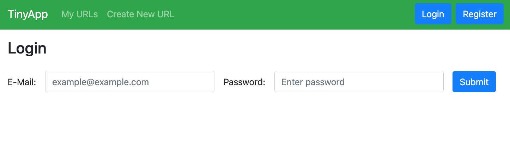
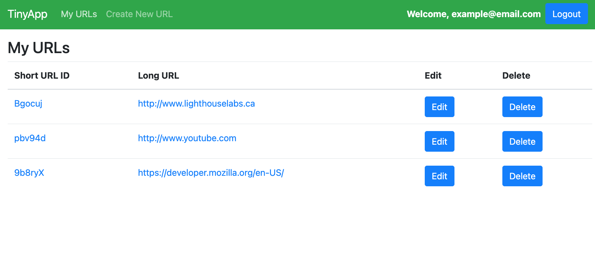
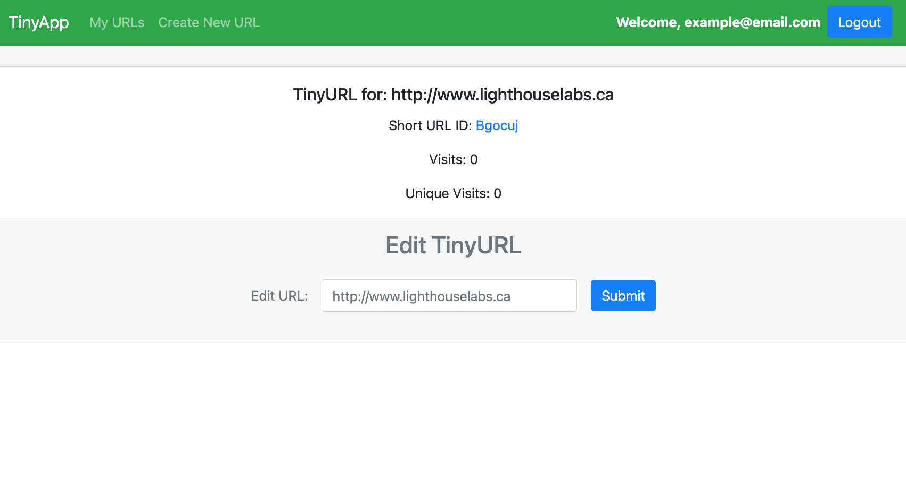

# TinyApp Project

TinyApp is a full stack web application built with Node and Express that allows users to shorten long URLs (à la bit.ly).

## Final Product

## Dependencies

- Node.js
- Express
- EJS
- bcryptjs
- cookie-session
- cookie-parser
- method-override
- moment.js

## Getting Started

- Install all dependencies (using the `npm install` command).
- Run the development web server using the `node express_server.js` command.
- Open preferred web browser and navigate to localhost:8080

## Using TinyApp

- Register account by clicking Register and submitting a valid email and password
- To create a tinyURL click "Create New URL" and submitting your desired URL
- To view your tinyURL's click "My URLs" or the TinyApp logo while logged in
- To edit your tinyURL's click "Edit" beside the desired tinyURL on the "My URLs" page
- to delete your tinyURL's click "Delete" beside the desired tinyURL on the "My URLs" page

## Using TinyURLs

- Each TinyURL has a unique ID upon creation
- To use your TinyURL click the TinyURL on the URL's page or the tinyURL's edit page
- You can also enter in your web browser address bar **localhost:8080/u/***tinyURL-Here*

## Cookies

- When logged in a session cookie is created
- When user logs out session cookie is destroyed
- When a new visitor uses a tinyURL a unique visitor cookie is created